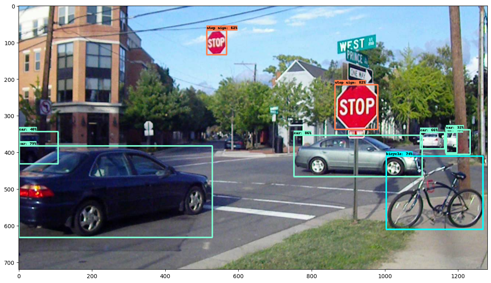

# Object Detection using SSD Mobilenet and Resnet
This repository contains code for implementing object detection using the Single Shot MultiBox Detector (SSD) and ResNet-50 algorithms with TensorFlow. Single Shot Multibox Detector (SSD) is a popular object detection algorithm known for its speed and accuracy. There are different versions of SSD using various base architectures, including ResNet50 and MobileNet. Here's a brief overview and a comparison between SSD ResNet50 and SSD MobileNet.

## SSD MobileNet Architecture
The SSD architecture is a single convolution network that learns to predict bounding box locations and classify these locations in one pass. Hence, SSD can be trained end-to-end. The SSD network consists of base architecture (MobileNet in this case) followed by several convolution layers

By using SSD, we only need to take one single shot to detect multiple objects within the image, while regional proposal network (RPN) based approaches such as R-CNN series that need two shots, one for generating region proposals, one for detecting the object of each proposal. Thus, SSD is much faster compared with two-shot RPN-based approaches.

For more details about SSD architecture and its working, please read it’s official paper [here](https://arxiv.org/pdf/1512.02325.pdf)

## SSD ResNet-50 Architecture
ResNet50 is a variant of the ResNet architecture, which introduces skip connections or residual connections. These connections help in mitigating the vanishing gradient problem during training deeper networks. SSD ResNet50 often incorporates a Feature Pyramid Network, which allows the model to leverage multi-scale features for object detection.

## Comparison
The choice between SSD ResNet50 and SSD MobileNet often involves a trade-off between accuracy and speed. If accuracy is a top priority and computational resources are sufficient, ResNet50 might be a better choice. For real-time applications on edge devices, where speed is crucial, MobileNet can be more appropriate.

## Results
Here are the examples of detection outputs on both images and videos:

| ResNet-50                              | MobileNetV2                                  |
| -----------------------------------    | -----------------------------------           |
|  |   |

| ResNet-50                              | MobileNetV2                                  |
| -----------------------------------    | -----------------------------------           |
|  |   |

| ResNet-50                              | MobileNetV2                                  |
| -----------------------------------    | -----------------------------------           |
|  |   |

| ResNet-50                              | MobileNetV2                                  |
| -----------------------------------    | -----------------------------------           |
|  |   |

### Video Results 

| ResNet-50                              | MobileNetV2                                  |
| -----------------------------------    | -----------------------------------           |
| [Resnet](./media/driving_resnet.mp4)   | [Mobilenet](./media/driving_mobilenet.mp4)     |

